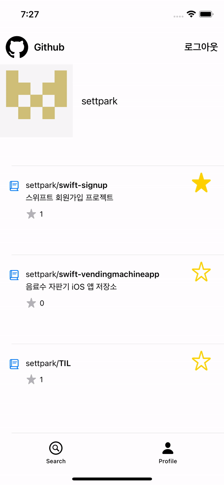

# githubApp

## 프로젝트 실행

아래의 경로에서 프로젝트 파일를 실행하고 빌드해주세요.
```
githubApp/GithubApp/GithubApp.xcworkspace
```

---

## githubApp 기능 목록

- 저장소 검색 기능, 검색된 저장소 목록 표시
- 검색 된 저장소 목록의 마지막 결과가 나올때까지 계속 스크롤할 수 있는 기능
- 로그인, 로그아웃 기능
- 로그인 된 유저의 이름, 이미지, 저장소 목록을 확인
- 저장소에 Star와 UnStar요청을 보낼 수 있는 기능

---

## githubApp 기능 상세 설명

### 1. 검색 기능

<p align="left"></p>

- 위와 같이 Github의 레포지토리 목록을 검색할 수 있습니다.
- 검색 좌측의 TextField란에 원하는 값을 입력 후 검색 버튼을 누르면 목록을 표시합니다.
- 최초에 100개의 목록을 받아옵니다.

### 2. 스크롤 기능

<p align="left"></p>

- 위와 같이 목록이 100개 보다 많으면 추가적으로 계속 목록을 추가할 수 있습니다.
- 목록의 가장 아래쪽에서 가볍게 스크롤 하면 새로운 목록이 추가됩니다. 새로운 목록의 개수는 100개 입니다.

### 3. 로그인 기능

<p align="left">

</p>

- 위의 왼쪽 이미지와 우상단에 보이는 로그인 버튼과 오른쪽 이미지의 중앙과 우상단의 버튼으로 모두 로그인 요청이 가능합니다.
- 로그인 버튼을 누르게 되면 아래의 이미지와 같이 github 로그인 창으로 이동합니다.

### 4. 로그인한 유저의 레포지토리 목록 보기

<p align="left">

</p>

- 로그인을 완료하면 로그인한 유저의 이미지와 유저의 이름, 유저의 repository 목록을 확인할 수 있습니다.

### 5. Star와 UnStar 

- 로그인이 된 상태라면 아래와 같이 레포에 star와 unstar 요청을 보낼 수 있습니다.
- 로그인이 되지 않은 상태라면 버튼을 눌러도 아무 반응도 일어나지 않습니다.

<p align="left">

</p>

### 6. 로그아웃

- 아래의 왼쪽 이미지와 가운데 이미지 우 상단에 보이는 버튼으로 모두 로그아웃 할 수 있습니다.
- 로그아웃하게 될 경우 현재 로그인 되었던 유저의 정보는 표시 되지 않습니다.
- 로그인 버튼으로 다시 로그인 할 수 있습니다.

<p align="left">


</p>

---
